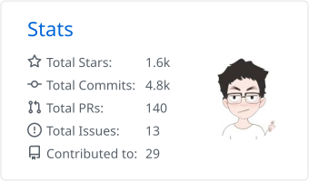

<h5>你好！  我是 Qiuner</h5>

多平台技术博主，专注 AI 领域

Multi-platform technical blogger focused on AI.

打造 <a href="https://github.com/Qiuner/claude-nexus"><b>claude-nexus</b></a>——在日常使用 Claude 的过程中，发现并实现了一些能显著提升产品体验的功能；维护 <a href="https://github.com/Qiuner/ai-application-roadmap"><b>ai-application-roadmap</b></a>——记录我对 AI 时代百家争鸣，你方唱罢我登场现象的观察与思考。

参与 <a href="https://github.com/anywhere-labs/dsh-desktop"><b>dsh-desktop</b></a> 项目，在桌面端架构、插件生态与工程稳定性方面持续贡献；同时也为 DSH 生态下的 <a href="https://github.com/ccch1mneyyy/dsh-TUI"><b>dsh-TUI</b></a> 与 <a href="https://github.com/zhu1090093659/dsh-web"><b>dsh-web-ui</b></a> 做出过贡献。

Building Claude workflow tools, writing about AI applications, and contributing to the DSH desktop/plugin ecosystem.

 
