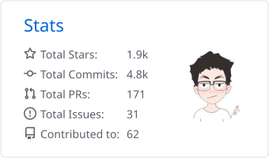

<h5>你好！  我是 Qiuner</h5>

多平台博客专家，专注 AI 领域

Multi-platform blogging expert focused on AI.

打造 <a href="https://github.com/Qiuner/claude-nexus"><b>claude-nexus</b></a>——在日常使用 Claude 的过程中，发现并实现了一些能显著提升产品体验的功能；维护 <a href="https://github.com/Qiuner/ai-application-roadmap"><b>ai-application-roadmap</b></a>——记录我对 AI 时代百家争鸣，你方唱罢我登场现象的观察与思考。

Building <a href="https://github.com/Qiuner/claude-nexus"><b>claude-nexus</b></a> to improve the everyday Claude experience, and maintaining <a href="https://github.com/Qiuner/ai-application-roadmap"><b>ai-application-roadmap</b></a> to document how AI applications evolve and compete.

发起 <a href="https://github.com/Qiuner/birdview"><b>Birdview</b></a>，践行 Architecture-first Coding：相信未来的编程归根结底是约束与架构，让 AI 在动手前先呈现对项目的理解和修改范围，由人审阅并确认后再进入实现。

Creating <a href="https://github.com/Qiuner/birdview"><b>Birdview</b></a> around Architecture-first Coding: I believe the future of programming comes down to constraints and architecture. AI should make its understanding of a project and its intended change scope visible before implementation, so people can review and confirm the plan first.

参与 <a href="https://github.com/anywhere-labs/dsh-desktop"><b>dsh-desktop</b></a> 项目，在桌面端架构、插件生态与工程稳定性方面持续贡献；同时也为 DSH 生态下的 <a href="https://github.com/ccch1mneyyy/dsh-TUI"><b>dsh-TUI</b></a> 与 <a href="https://github.com/zhu1090093659/dsh-web"><b>dsh-web-ui</b></a> 做出过贡献。

Contributing to <a href="https://github.com/anywhere-labs/dsh-desktop"><b>dsh-desktop</b></a> across desktop architecture, plugin ecosystems, and engineering stability, as well as to <a href="https://github.com/ccch1mneyyy/dsh-TUI"><b>dsh-TUI</b></a> and <a href="https://github.com/zhu1090093659/dsh-web"><b>dsh-web-ui</b></a> in the DSH ecosystem.

Exploring a future of programming shaped by constraints, architecture, and human-guided AI.

 
